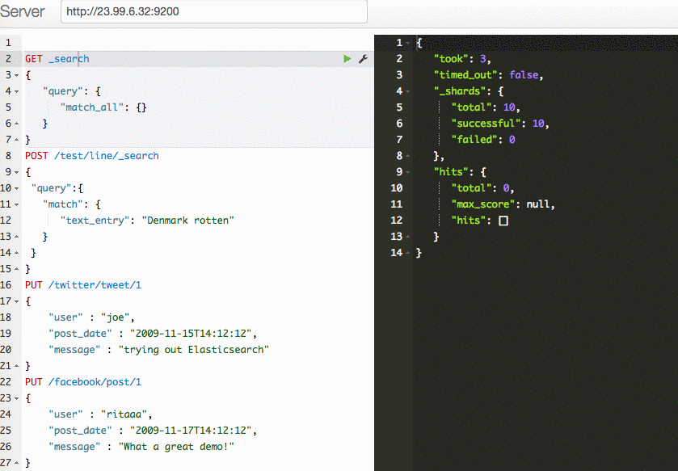

# Deployment of an ElasticSearch cluster on Azure using SaltStack

[SaltStack](https://github.com/saltstack/salt) is an Open Source project that aims to deliver infrastructure as code and configuration management with abstraction of the cloud provider selected. This repo is an end-to-end example of provisioning an ElasticSearch cluster on Azure using SaltStack configurations.

> :triangular_flag_on_post: NOTE: The support of Azure ARM by SaltStack is still in preview. The documentation is non-existent and a lot of the configuration settings had to be done by experimentation and reading the code. Hope this repo serves as both an example as well as documentation.

## Overview
The model of SaltStack is based on master and minions with each minion agent reaching back to the master; this makes the solution very scalable. The master holds the configuration of the minions in a set of configuration files. Those files provide an idempotent configuration that will be applied when the minion role is deployed or at any time the configuration is re-applied.

## Installation
Clone this repo:

    git clone https://github.com/ritazh/azure-saltstack-elasticsearch

Get Azure CLI [here](https://docs.microsoft.com/en-us/azure/xplat-cli-install) if you don't already have it. Then log into the CLI:
	
	azure login
	azure account show

Now create a service principal, following [these steps](https://docs.microsoft.com/en-us/azure/azure-resource-manager/resource-group-authenticate-service-principal-cli).

The output should look somehing like the following:
```
{
    "objectId": "ff863613-e5e2-4a6b-af07-fff6f2de3f4e",
    "objectType": "ServicePrincipal",
    "displayName": "exampleapp",
    "appId": "7132aca4-1bdb-4238-ad81-996ff91d8db4",
    "servicePrincipalNames": [
      "https://www.contoso.org/example",
      "7132aca4-1bdb-4238-ad81-996ff91d8db4"
    ]
  }

```

Now you are ready to kickoff the scripts. Sit back and enjoy a cup of coffee. Once the script is done, you will have a working ElasticSearch cluster ready to be used. 
  	
  	deploy-salt-cluster.sh -o create -u <adminUsername> -n <namespaceForResourceGroup> -c <servicePrincipalAppId> -s <serviceprincipalsecret> -t <tenantid>

Look for the IP address of `${namespaceForResourceGroup}minionesmaster` from the Azure portal, use this IP to query and add new content to your search index. 



## Acknowledgement
Many thanks to [@baronomasia](https://github.com/baronomasia) for helping me troubleshoot Salt configurations and making it all come together.


